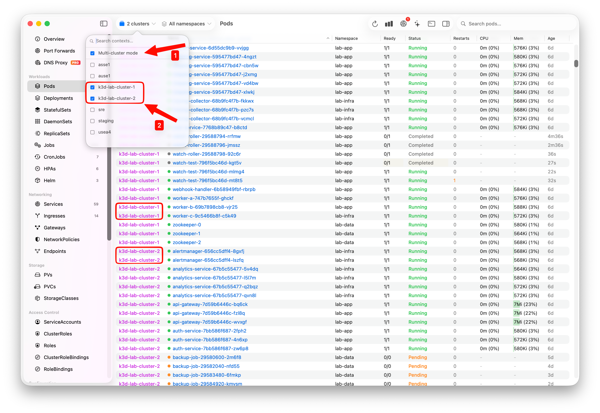

# Krust

Krust is a **native Kubernetes desktop app for production operations on macOS**.

This public repository is for product information, roadmap discussion, and issue tracking.
It does **not** contain the Krust application source code.



## Why Krust

Krust is built for engineers who want a **Lens alternative** that feels native on macOS and stays focused on operational speed.

- Native macOS desktop experience
- Kubernetes multi-cluster operations workflow
- Integrated logs, terminal, YAML, and resource navigation
- No forced account for normal product use
- Zero telemetry by default

If you are searching for a **Lens alternative**, **k9s alternative**, or a **native Kubernetes desktop client for macOS**, this repository is the right place to follow Krust updates.

## Why Teams Look for Alternatives

Recurring community pain themes around Kubernetes desktop tools usually sound like this:

- OpenLens/Freelens maintenance confidence issues
- Lens feeling slow/heavy for large clusters
- Lens account/closed-source friction for some teams
- k9s being powerful but harder for non-CLI teammates
- Ongoing demand for a **lightweight Kubernetes dashboard alternative** on macOS

Krust is focused on this exact gap: a **native Kubernetes desktop app** for production operations on macOS that is fast, low-overhead, and team-friendly.

## What Krust Optimizes For

- Fast incident workflows: logs, exec, YAML review, and verification in one place
- Multi-cluster operations without constant context switching
- Native macOS performance instead of Electron-style runtime overhead
- Local-first workflow using your existing kubeconfig

## Enterprise-Friendly Direction

Krust is especially relevant for teams that care about:

- macOS-first developer workflows
- EKS/AKS/GKE access through real kubeconfig-based auth flows
- reducing account/licensing friction in desktop Kubernetes tooling
- giving non-CLI teammates a usable operational UI

## Download

- Download latest DMG: https://github.com/vanchonlee/homebrew-tap/releases/latest
- Install via Homebrew:

```bash
brew install vanchonlee/tap/krust
```

## Product Links

- Website: https://krust.io/
- Docs: https://krust.io/docs/
- Lens alternative docs: https://krust.io/docs/vs-lens/
- Kubernetes dashboard alternative docs: https://krust.io/docs/kubernetes-dashboard-alternative/
- Changelog: https://krust.io/docs/changelog/
- Pricing & licensing: https://krust.io/docs/licensing/

## What This Repo Is For

- Report product bugs
- Request features
- Ask usage questions
- Follow release and roadmap updates

## What This Repo Is Not For

- Application source code browsing
- Pull requests for app implementation

## Issue Templates

Please use the issue forms so we can triage quickly:

- Bug report
- Feature request
- Question

## Security

If you found a security issue, please do not open a public issue.
Contact: **security@krust.io**

## Trademark

Krust and associated marks are proprietary to the Krust team.
