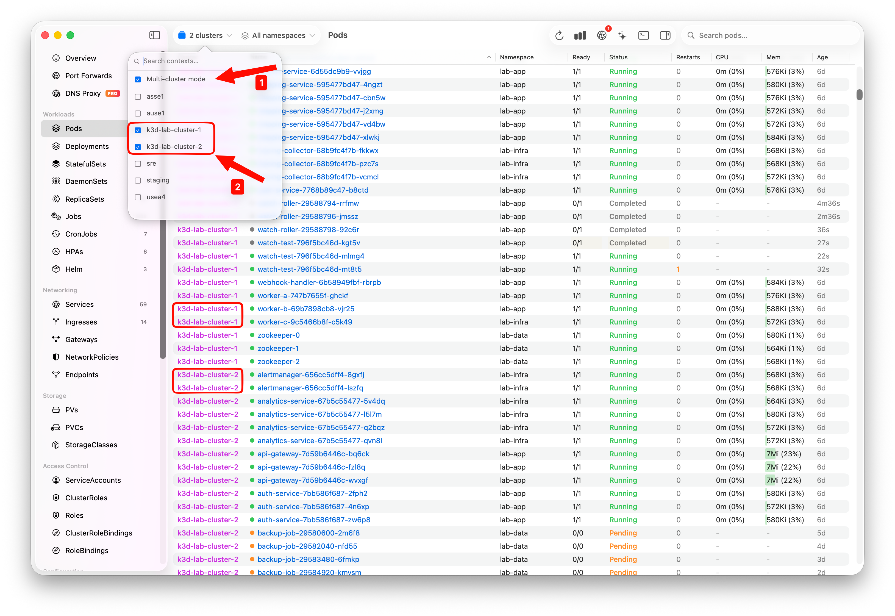

<p align="center">
  
</p>

<h1 align="center">Krust</h1>

<p align="center">
  Native macOS Kubernetes dashboard for production operations.
  <br />
  Built for engineers who want a lighter Lens alternative without an Electron runtime, cloud account, or cluster agent.
</p>

<p align="center">
  <a href="https://krust.io/">Website</a>
  |
  <a href="https://krust.io/docs/">Docs</a>
  |
  <a href="https://github.com/vanchonlee/krust/releases/latest">Download</a>
  |
  <a href="https://krust.io/docs/vs-lens/">Krust vs Lens</a>
  |
  <a href="https://krust.io/docs/kubernetes-dashboard-alternative/">Dashboard Alternatives</a>
  |
  <a href="https://github.com/vanchonlee/krust/issues">Issues</a>
</p>

<p align="center">
  <a href="https://github.com/vanchonlee/krust/releases/latest">
    
  </a>
  <a href="https://github.com/vanchonlee/krust/releases/latest">
    
  </a>
  <a href="https://github.com/vanchonlee/krust/releases/download/v1.5.2/krust-1.5.2.dmg">
    
  </a>
  <a href="https://krust.io/docs/licensing/">
    
  </a>
</p>

---

## Download

**Direct download**

- [Download the latest DMG](https://github.com/vanchonlee/krust/releases/latest)
- [Download `krust-1.5.2.dmg`](https://github.com/vanchonlee/krust/releases/download/v1.5.2/krust-1.5.2.dmg)

**Homebrew**

```bash
brew install --cask vanchonlee/tap/krust
```

Homebrew also installs the `k9r` terminal command packaged with Krust.

## What Is Krust?

Krust is a native Kubernetes desktop app for macOS. It reads your existing kubeconfig and gives you a fast local workspace for cluster resources, logs, YAML, Helm releases, CRDs, topology, metrics, port forwarding, security checks, and incident workflows.

Krust is designed for Mac-first DevOps and SRE workflows where a GUI should feel like a native tool, not a browser runtime in a window.

## Features

- **Native macOS app**: Rust core with a Swift/AppKit/SwiftUI interface.
- **No Electron runtime**: built for lower overhead and a more native desktop feel.
- **Existing kubeconfig**: works with normal Kubernetes auth flows for EKS, AKS, GKE, and on-prem clusters.
- **Resource workspace**: inspect pods, deployments, services, config, RBAC, CRDs, Gateway API resources, and more.
- **Fast logs**: single-pod and incident-oriented log workflows with search, filters, bookmarks, and export.
- **YAML and diffs**: inspect live YAML, compare resources, review changes, and work through cluster state visually.
- **Helm workflows**: inspect releases, history, values, manifests, diffs, and rollback context.
- **Topology and metrics**: understand workload relationships and Prometheus-backed resource signals.
- **Port forwarding**: manage local routes and service access from a desktop workflow.
- **Security checks**: review common workload, RBAC, image, and configuration issues.
- **K9r terminal preview**: terminal-native Kubernetes navigation powered by the same product family.

## Why Teams Try Krust

Krust is for teams and individual engineers who like the speed of terminal tools but still want a visual workspace during production work.

Common reasons people evaluate Krust:

- Lens or Electron-based Kubernetes tools feel heavy on large clusters.
- OpenLens/Freelens maintenance or packaging creates uncertainty.
- k9s is excellent for terminal users but harder for mixed-experience teams.
- Kubernetes Dashboard requires in-cluster installation that some teams avoid.
- Mac-first operators want a local app that feels like it belongs on macOS.

## Krust vs Other Kubernetes Tools

| Need | Good Fit |
| --- | --- |
| Native macOS Kubernetes dashboard | Krust |
| Cross-platform Kubernetes IDE | Lens, Aptakube, Headlamp |
| Terminal-first workflows | k9s, kubectl, k9r |
| In-cluster web dashboard | Kubernetes Dashboard, Headlamp |
| Local-first incident workspace | Krust |

Read more:

- [Krust vs Lens](https://krust.io/docs/vs-lens/)
- [Krust vs k9s](https://krust.io/docs/vs-k9s/)
- [Kubernetes dashboard alternatives](https://krust.io/docs/kubernetes-dashboard-alternative/)

## Links

- Website: https://krust.io/
- Documentation: https://krust.io/docs/
- Quick start: https://krust.io/docs/quick-start/
- Features: https://krust.io/docs/features/
- Changelog: https://krust.io/docs/changelog/
- Pricing and licensing: https://krust.io/docs/licensing/
- Latest release: https://github.com/vanchonlee/krust/releases/latest

## Repository Scope

This repository is the public product, release, roadmap, and issue tracker for Krust.

It is for:

- Downloading releases
- Reporting product bugs
- Requesting features
- Asking setup and usage questions
- Following roadmap and changelog updates

It is not for:

- Browsing the Krust application source code
- Opening pull requests for core app implementation

## Support

- Bug report: use the [bug report issue form](https://github.com/vanchonlee/krust/issues/new?template=bug_report.yml)
- Feature request: use the [feature request issue form](https://github.com/vanchonlee/krust/issues/new?template=feature_request.yml)
- Question: use the [question issue form](https://github.com/vanchonlee/krust/issues/new?template=question.yml)
- Docs: https://krust.io/docs/

## Security

Please do not open public issues for security vulnerabilities.

Report sensitive security issues to **security@krust.io**.

## Trademark

Krust and associated marks are proprietary to the Krust team.
